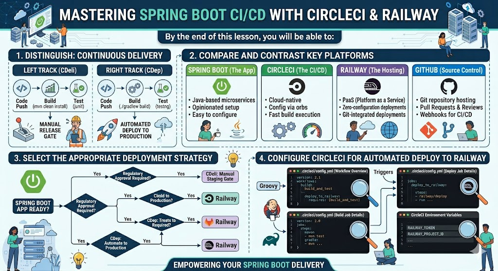

# [4.12] Continuous Deployment - Automated Deployment to Railway

## Lesson Overview

## Dependencies
- [Self Studies](./studies.md)
- [Lesson](./lesson.md)
- [Assignment](./assignment.md)

## Lesson Objectives
* **Distinguish** between Continuous Delivery and Continuous Deployment
* **Deploy** a Spring Boot application to Railway
* **Configure** CircleCI to automatically deploy applications after successful tests
* **Implement** a complete CI/CD pipeline from code push to production

## Lesson Plan

| Duration | What | How or Why |
|----------|------|------------|
| 10 min | Warm up | Intro and lesson overview, verify prerequisites and CircleCI pipeline status |
| 30 min | Part 1: CD concepts | Continuous Delivery vs Deployment, CD principles, benefits, pipeline stages, deployment environments, A/B testing |
| 30 min | Part 2: Prepare Railway for deployment | Create Railway account, deploy devops-demo manually, generate public domain, verify endpoint |
| 10 min | Activity 1 — Manual deployment discussion | Learners discuss what's still manual in the current setup and what needs to be automated |
| 75 min | Part 3: Automate deployment with CircleCI | Get Railway token and IDs, add credentials to CircleCI, add deploy job to config.yml, push and watch full pipeline run |
| 20 min | Part 4: Test the full pipeline | Make code change, push, watch automation, verify live endpoint |
| 10 min | Part 5: Understanding what you built | Full CI/CD pipeline recap, professional DevOps practices review |
| 10 min | Recap and wrap up | Key takeaways, troubleshooting tips, Q&A |
| **Total** | | **175 min — allows ~5 min buffer** |